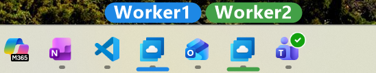

# Taskbar Marker

Color-code and label individual taskbar buttons on Windows 11 — so two windows of the
*same* app (two Remote Desktop sessions, two VS Code workspaces, two Chrome profiles)
stop looking identical.

No DLL injection, no hooking, no admin rights. It reads the taskbar through
UI Automation and paints a click-through overlay on top of it.



## How it works

1. **Read** — every Windows 11 taskbar button is a normal UI Automation `Button`.
   `AutomationElement.FromHandle(Shell_TrayWnd)` gives us each button's name,
   application id and on-screen rectangle.
2. **Match** — rules from `rules.json` are regex-tested against the name and app id.
3. **Paint** — a layered, always-on-top, `WS_EX_TRANSPARENT` window draws a colored bar
   under each matched button plus an optional label chip above the taskbar. Mouse input
   falls straight through to the real taskbar.

Nothing is injected into `explorer.exe`, so a Windows update can't crash your shell —
worst case the overlay stops appearing.

## Build and run

```powershell
dotnet build -c Release
.\bin\Release\net8.0-windows\TaskbarMarker.exe
```

Requires the .NET 8 Desktop Runtime. The app lives in the system tray.

## Writing rules

Right-click the tray icon (or double-click it) and pick **Edit rules...**:

**Add...** opens a picker that reads the taskbar live, so a target is chosen rather than typed:

Selecting a button fills in the pattern automatically. When several buttons share the same
name — the normal case for two windows of one app while grouping is on — it matches on the
app id instead, because that is the only field that tells them apart.

Every add, edit, remove and reorder is written to
`%LOCALAPPDATA%\TaskbarMarker\rules.json` and applied immediately; there is no separate
save or reload step. Editing the file by hand also works — it is watched and picked up
automatically. Keeping user rules outside the build directory prevents rebuilds and
upgrades from deleting personal connection mappings.

`TaskbarMarker.exe --edit` opens just the editor, which is handy as a shortcut. A background
instance notices the saved file on its own.

### rules.json

```json
{
  "pollIntervalMs": 750,
  "barHeight": 4,
  "barInset": 6,
  "showLabel": true,
  "labelFontSize": 9,
  "rules": [
    { "matchAppId": "Windows365:11111111", "color": "#E53935", "label": "task1" },
    { "matchAppId": "Windows365:22222222", "color": "#43A047", "label": "investing" },
    { "match": "Visual Studio Code",       "color": "#1E88E5", "label": "code" }
  ]
}
```

| Field | Meaning |
| --- | --- |
| `match` | Case-insensitive regex tested against the button name |
| `matchAppId` | Case-insensitive regex tested against the app id |
| `color` | Hex color for the bar and the label chip |
| `label` | Optional short text; omit it for a color bar only |

Both `match` and `matchAppId` may be given, in which case both must hit. Rules are
evaluated in order and the first hit wins.

| Setting | Default | Meaning |
| --- | --- | --- |
| `pollIntervalMs` | `750` | How often the taskbar is rescanned. Lower feels snappier but costs CPU |
| `barHeight` / `barInset` | `4` / `6` | Bar thickness and horizontal inset, in px at 100% scaling |
| `showLabel` | `true` | Draw the label chip above the taskbar |
| `labelFontSize` | `9` | Chip font size in points at 100% scaling |
| `includeAllButtons` | `false` | Also allow matching Start / Search / Widgets / tray icons |

Sizes scale automatically with each monitor's DPI, derived from the taskbar height.

### Inspecting what the taskbar exposes

**List taskbar buttons** in the tray menu (or `TaskbarMarker.exe --list`) writes a report of
every button UI Automation can see, with its name, app id and rectangle, and flags which
rule each one matched. Useful when a rule does not fire:

```
  * {X=1013,Y=2088,Width=66,Height=72} Remote Desktop - 1 running window  <== MATCH label=task1
    appId: MicrosoftCorporationII.Windows365_8wekyb3d8bbwe!Windows365:11111111-...
  * {X=1079,Y=2088,Width=66,Height=72} Remote Desktop - 1 running window
    appId: MicrosoftCorporationII.Windows365_8wekyb3d8bbwe!Windows365:22222222-...
```


## Notes and limits

- **Windows 11 only.** Windows 10 exposes its taskbar differently.
- **Horizontal taskbars only.** Vertical ones are skipped.
- Overlays hide automatically while a genuinely full-screen app is in front, and while
  the taskbar is slid away by auto-hide.
- With taskbar grouping on, two windows of the same app share one button. Use
  `matchAppId` to tell them apart, or turn grouping off (Settings → Personalization →
  Taskbar → Taskbar behaviors → Combine taskbar buttons → Never) to get one button per
  window with the window title as its name.

## Layout

| Path | Purpose |
| --- | --- |
| `Program.cs` | Entry point, tray icon, poll timer, rules.json watcher |
| `OverlayCoordinator.cs` | Scan → match → paint loop, one overlay per taskbar |
| `TaskbarScanner.cs` | UI Automation reader |
| `TaskbarOverlay.cs` | Layout and GDI+ rendering of bars and chips |
| `OverlayWindow.cs` | Layered click-through window |
| `RulesEditorForm.cs` | Rule list editor |
| `RuleEditDialog.cs` | Single-rule editor with the live taskbar picker |
| `Settings.cs` | `rules.json` model, matching, load/save |
| `Diagnostics.cs` | `--list` report |
| `Native.cs` | Win32 interop |
